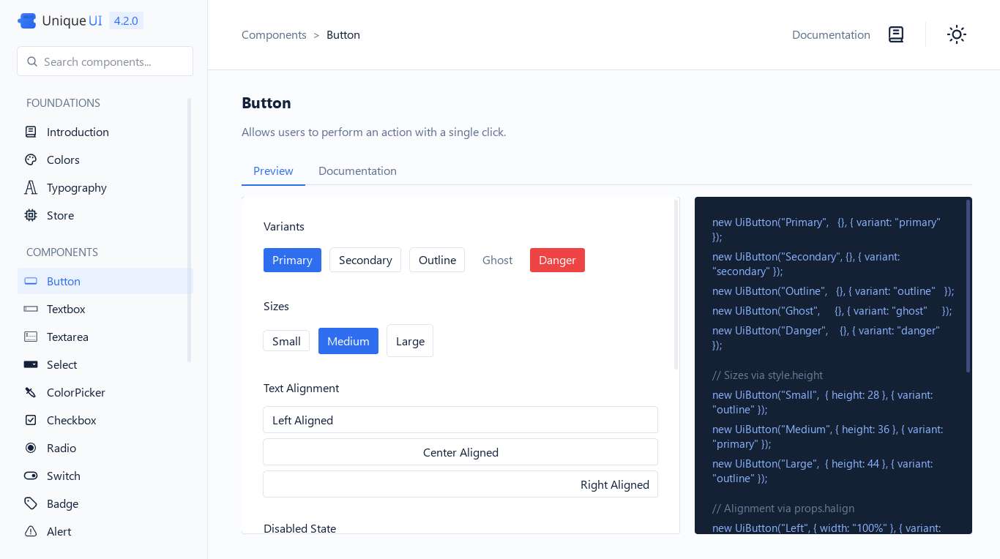
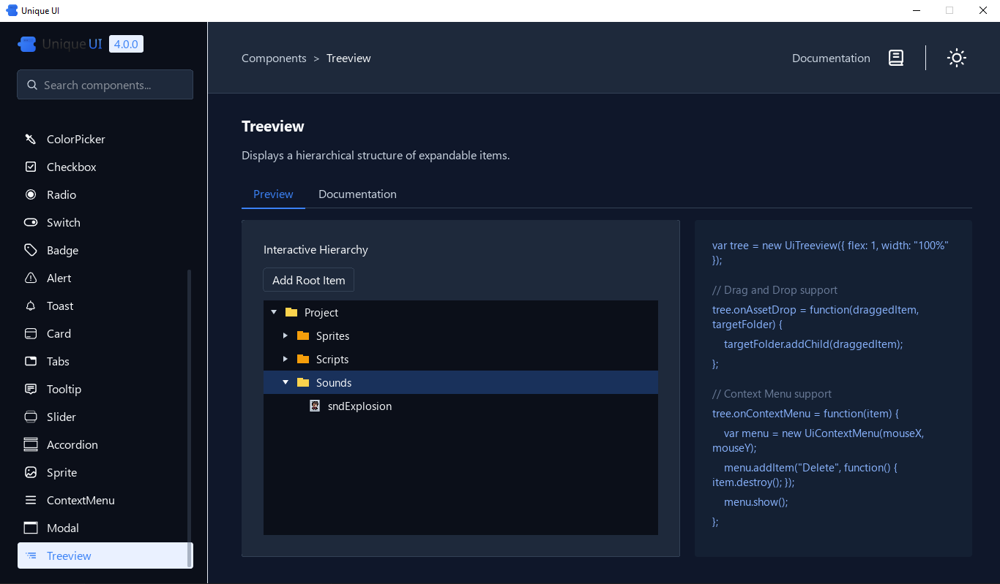

### A high-performance, UI  Engine for GameMaker.

UniqueUI is a state-of-the-art UI system designed for GameMaker, bridging the gap between declarative design and high-performance execution. Built on a foundation of native performance and object-oriented flexibility, it provides developers with the tools to build complex, scalable, and visually stunning interfaces.



[Try the online demo (GX Export)](https://manuel-di-iorio.github.io/unique-ui/demo)

---

## CORE PILLARS

### 1. DECLARATIVE FLEXBOX LAYOUT
UniqueUI integrates directly with GameMaker’s native Flexpanel (Yoga) implementation. This allows for complex, responsive layouts using standard Flexbox properties-align-items, justify-content, flex-grow, and more-all handled through a high-level GML API.

### 2. ADVANCED SPATIAL PARTITIONING
To handle thousands of interactive elements without performance degradation, UniqueUI utilizes a custom **Dynamic AABB Tree 2D**. This spatial partitioning system ensures that mouse interaction and hover detection remain O(log N), regardless of interface complexity.

### 3. COMPREHENSIVE EVENT PIPELINE
The framework features a sophisticated event system supporting Capture and Bubble phases, mirroring modern web standards. Developers can attach listeners for clicks, drag-and-drop operations, scroll events, and focus changes with full control over event propagation.

### 4. MODERN AESTHETIC DEFAULTS
UniqueUI ships with a curated "Modern Premium" design system. Components feature smooth gradients, subtle micro-animations, ripple effects, and glassmorphism-ready containers out of the box.

---



## TECHNICAL FEATURES

*   **Node-Based Architecture**: Everything is a `UiNode`. Compose complex views by nesting nodes and components.
*   **Intelligent Clipping**: Automatic GPU scissor intersection ensures that content is perfectly clipped within scrollable containers and nested layouts.
*   **Focus Management**: Built-in system for keyboard navigation (Tab/Shift+Tab) and focus-trapping.
*   **Drag & Drop API**: First-class support for draggable elements and drop-zones with visual feedback.
*   **Z-Index & Draw Order**: Automatic management of rendering order based on the node hierarchy and spatial tree.
*   **Extensible Component Library**: Over 20 pre-built components including Textareas with multi-line support, Modals, Accordions, and Tree-views.

---

## QUICK START

### Initialization
Define the container in your controller object's Create event.

```javascript
// Create a centered panel with a button
var panel = new UiNode({
    width: 400,
    height: 300,
    backgroundColor: #FFFFFF,
    borderRadius: 8,
    justifyContent: "center",
    alignItems: "center"
}, { border: true });

var btn = new UiButton("Get Started", { variant: "primary" });
btn.onClick(function() {
    show_debug_message("System Online.");
});

panel.add(btn);
global.UI.add(panel);
```

### Lifecycle Management
UniqueUI requires minimal boilerplate in the object lifecycle.

```javascript
// Step Event
global.UI.update();

// Draw GUI Event
global.UI.render();
```

---

## COMPONENT ECOSYSTEM

The framework includes a wide array of production-ready components:

*   **Layout Controls**: UiNode, UiScrollbar, UiTabs, UiAccordion.
*   **Inputs**: UiTextbox, UiTextarea, UiCheckbox, UiRadio, UiSwitch, UiSlider, UiDropdown.
*   **Display**: UiText, UiSprite, UiBadge, UiTooltip.
*   **Feedback**: UiAlert, UiModal, UiContextMenu.
*   **Navigation**: UiTreeview, UiTabs.

---

## PERFORMANCE SPECIFICATIONS

UniqueUI is optimized for high-refresh-rate applications:
*   **Batched Updates**: Layout calculations are only performed when nodes are "dirty."
*   **Spatial Queries**: Hover detection is offloaded to the Dynamic AABB Tree, bypassing the need to iterate through the entire node list.
*   **Surface Caching**: The Root UI can be configured to render to surfaces, reducing draw calls for static interface sections.

---

## INSTALLATION

1. Import the `uui.yymps` package into your GameMaker project.
2. Ensure the `scripts` directory is correctly placed.
3. Access components via the `Ui*` constructor functions.

---

## AI NOTE

I use AI to develop UniqueUI (through tools like Codex, Antigravity, and Copilot) and to generate its documentation and descriptions, as I prefer being open about it.

UniqueUI is still designed, architected, and directed by me. AI is simply part of the workflow, a tool that helps speed up repetitive tasks, explore edge cases, and keep the project moving fast without sacrificing quality. Instead of replacing craftsmanship, it lets me spend more time on the parts that actually matter, design decisions, usability, performance, and polish.

---

## LICENSE
Distributed under the MIT License. Copyright 2025-2026 Emmanuel Di Iorio.
